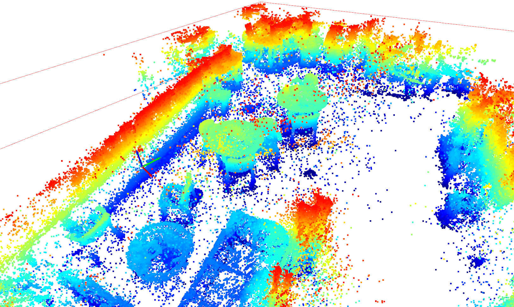

# Point Cloud Processing Tools

Setting up a simple env

```shell
conda create -n pcd_tools python=3.10
conda install open3d
pip install gdown
```

Download example point cloud of an office environment with tables and chairs to `data/point_cloud.ply`

```shell
python 0_download_data.py
```

Run example pointcloud cropping, RANSAC, filtering, and visualizing

```shell
python 1_example_pipeline.py
```

Example output screenshot I took:



References:
* Creating point cloud and distill semantic features from video or images: [Gaussian Feature Splacking](https://github.com/zt-yang/gaussian-feature-splacking) (private repo, message Yang your github handle for access)